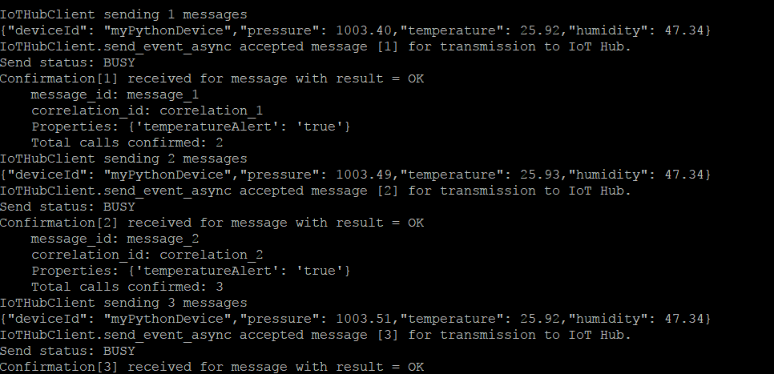

# IoT Hub Raspberry Pi 3 Client application

> This repo contains the source code to help you get started with Azure IoT using the Microsoft IoT Pack for Raspberry Pi 3 Starter Kit. You will find the [full tutorial on Docs.microsoft.com](https://docs.microsoft.com/en-us/azure/iot-hub/iot-hub-raspberry-pi-kit-c-get-started).

This repo contains a python application that runs on Raspberry Pi 3 with a BME280 temperature&humidity sensor, and then sends these data to your IoT hub. At the same time, this application receives Cloud-to-Device messages from your IoT hub, and takes actions according to the C2D command. 

## Step 1: Set up your Pi
### Enable SSH on your Pi
Follow [this page](https://www.raspberrypi.org/documentation/remote-access/ssh/) to enable SSH on your Pi.

### Enable I2C on your Pi
Follow [this page](https://www.raspberrypi.org/documentation/configuration/raspi-config.md) to enable I2C on your Pi

## Step 2: Connect your sensor with your Pi
### Connect with a physical BME280 sensor and LED
You can follow the image to connect your BME280 and an LED with your Raspberry Pi 3.


### DON'T HAVE A PHYSICAL BME280?
You can use the application to simulate temperature&humidity data and send to your IoT hub.
1. Open the `config.py` file.
2. Change the `SIMULATED_DATA` value from `False` to `True`.

## Step 3: Download and setup referenced modules

1. Clone the client application to local:

   ```
   sudo apt-get install git-core

   git clone https://github.com/Azure-Samples/iot-hub-python-raspberrypi-client-app.git   
   
   ```
   
2. Because the Azure IoT SDKs for Python are wrappers on top of the [SDKs for C][azure-iot-sdk-c], you will need to compile the C libraries if you want or need to generate the Python libraries from source code.

   ```
   cd ./iot-hub-python-raspberrypi-client-app
   sudo chmod u+x setup.sh
   sudo ./setup.sh
   ```
   In the above script, we run **./setup.sh** without parameter, so the shell will automatically detect and use the version of python installed (Search sequence 2.7->3.4->3.5). Alternatively, you can use a parameter to specify the python version which you want to use like this: **sudo ./setup.sh [--python-version|-p] [2.7|3.4|3.5]**


    Known build issues: 

    1.) On building the Python client library (`iothub_client.so`) on Linux devices that have less than **1GB** RAM, you may see build getting **stuck** at **98%** while building `iothub_client_python.cpp` as shown below

    ``[ 98%] Building CXX object python/src/CMakeFiles/iothub_client_python.dir/iothub_client_python.cpp.o``

    If you run into this issue, check the **memory consumption** of the device using `free -m command` in another terminal window during that time. If you are running out of memory while compiling iothub_client_python.cpp file, you may have to temporarily increase the **swap space** to get more available memory to successfully build the Python client side device SDK library.

## Step 4: Run your client application

Run the client application, and you need to provide your Azure IoT hub device connection string, note your connection string should be quoted in the command:
   ```
   python app.py '<your Azure IoT hub device connection string>'
   ```
If you use the python 3, then you can use the command below:
   ```
   python3 app.py '<your Azure IoT hub device connection string>'
   ```

If the application works normally, then you will see the screen like this:



